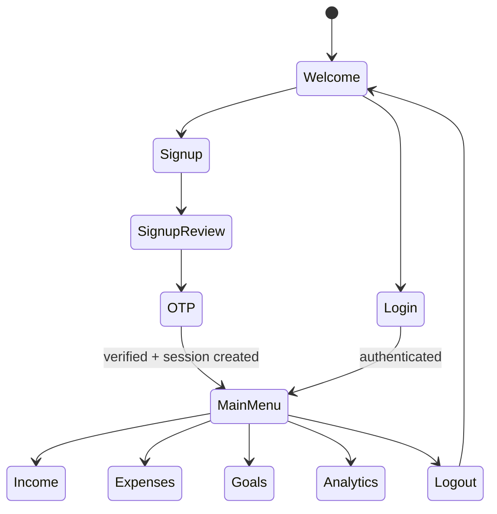

# FinTrack AI — Native Chatbot Architecture and End-to-End Workflow

> This document describes the current FastAPI + HTML/CSS/JavaScript implementation. Executable source and the live SQLite schema are authoritative.

## 1. Current outcome

FinTrack AI has one user-facing interface: a responsive chatbot served directly by FastAPI at `/`.

All interactive financial work stays inside the compact chatbot shell:

- brand and authenticated-session status,
- assistant/user conversation bubbles,
- option buttons,
- login, signup, OTP, profile, goal, and saving forms,
- review/confirmation summaries,
- financial metrics, tables, warnings, and CSS charts,
- one persistent free-text composer.

The surrounding white-and-orange page contains only product information about FinTrack AI and its profile → plan → progress journey. There are no separate financial dashboard pages, no Streamlit server, and no Flask/Jinja runtime.

```mermaid
flowchart TD
    B[Browser chatbot] -->|GET / and /static assets| F[FastAPI]
    B -->|Same-origin JSON + Bearer token| API[/api routes]
    API --> AU[Auth service]
    API --> P[Profile service]
    API --> G[Goal and history service]
    API --> AN[Analytics service]
    G --> R[Recommendation engine]
    AU --> E[Brevo OTP email]
    AU --> DB[(fintrackai.db)]
    P --> DB
    G --> DB
    AN --> DB
    R --> DB
```

## 2. Active repository structure

```text
Fintrack-Ai/
├── app.py                    # FastAPI, safe handlers, API routes, frontend/static serving
├── frontend/
│   ├── index.html            # Product information shell plus compact chatbot
│   ├── app.css               # Responsive white/orange visual system
│   └── app.js                # Deterministic state machine, API client, free-query placeholder
├── db.py                     # DB path, connections, transactions, migrations, ID allocation
├── schemas.py                # Pydantic input/output models and enums
├── errors.py                 # Safe application errors and HTTP mappings
├── recommendation.py         # Typed, guarded recommendation calculation
├── services/
│   ├── auth_service.py       # Persistent signup, OTP, sessions, login/logout
│   ├── email_service.py      # Configurable Brevo delivery
│   ├── profile_service.py    # Income and expense operations
│   ├── goal_service.py       # Goals, ownership, saving history
│   └── analytics_service.py  # User-scoped partial/full analytics
├── tests/                    # Temporary-database API, calculation, and frontend tests
├── fintrackai.db             # Preserved SQLite data
├── .env                      # Local gitignored secrets/configuration
├── .env.example              # Safe configuration template
├── requirements.txt          # FastAPI runtime and test packages
└── archive/legacy_flask_templates/
                                # Historical pages; not served or loaded
```

## 3. Runtime

Load `.env`, then run one process:

```bash
set -a
source .env
set +a
uvicorn app:app --host 0.0.0.0 --port 8000 --reload
```

URLs:

| URL | Purpose |
|---|---|
| `/` | Native chatbot frontend |
| `/static/app.css` | Chat UI styles |
| `/static/app.js` | Guided state machine and API calls |
| `/api/health` | Non-sensitive health/database connectivity |
| `/docs` | FastAPI-generated API documentation |

FastAPI resolves the frontend directory and database relative to Python source files, not the process working directory.

## 4. Chatbot frontend structure

### HTML shell

`frontend/index.html` uses a responsive two-column desktop layout: FinTrack product information on the left and one compact `.chatbot` component on the right. The chatbot has four persistent regions:

1. `.chat-header`: FinTrack identity, connection/session label, in-chat menu shortcut.
2. `#notice`: backend-availability notice, still inside the chatbot.
3. `#chatScroll`: conversation history, current active form/control bubble, and a trailing `#anytimeMessages` thread.
4. `.composer-wrap`: ordinary-query text input and send button.

No account data, financial form, or financial result renders outside the chatbot. The page-level content explains cash flow, goal planning, contribution tracking, and the overall FinTrack journey.

### CSS behavior

`frontend/app.css` provides:

- white-and-orange FinTrack identity,
- distinct assistant and user bubbles,
- in-bubble option grids, fields, buttons, summaries, metrics, tables, and bar charts,
- keyboard focus indicators and hidden accessible labels,
- reduced-motion support,
- a stacked responsive information-and-chat layout below 960px,
- a compact, bounded chat window on desktop with an always-visible composer.

No external JavaScript, chart library, font service, or image dependency is required.

### JavaScript state

`frontend/app.js` maintains:

```text
token                 raw bearer token for this browser tab
user                  safe authenticated summary
messages[]            assistant/user text bubbles
anytimeMessages[]     ordinary questions and fixed responses shown after the active step
flow                  active deterministic chatbot state
mode                  add/update/history-selection mode
draft                 unconfirmed form values
selected              selected owned profile or goal
data                  recommendation, analytics, or prerequisites
signup                pending signup email state
```

Only `token`, safe `user`, the last 80 guided messages, and the last 20 ordinary query messages are stored in `sessionStorage`. Passwords, OTPs, unconfirmed financial drafts, and selected financial records are never persisted by the browser.

On page reload with a token, the chatbot calls `/api/auth/me`. A valid session returns to the authenticated main menu. Invalid or expired sessions are cleared and return to login/signup options.

### Free-text query behavior

The composer is always available, including while a guided form remains open.

Current sequence:

1. User types any non-empty ordinary query.
2. The exact query becomes a user bubble in the trailing ask-anytime thread below the current guided step.
3. No API/LLM call occurs.
4. A fixed assistant bubble is added:

   ```text
   Thanks for your question. General AI responses are coming soon. For now,
   I can record the query and keep guiding you through the available FinTrack actions.
   ```

5. The response scrolls into view, while the active guided form/options remain available and retain current DOM input values.

Future LLM integration can replace only the composer submit handler with a new endpoint call. The option-driven financial state machine does not need to change.

## 5. Guided chatbot flow



### Unauthenticated welcome

Assistant options:

- Log in
- Create an account

The user can also type a normal query and receive the fixed response without changing the active welcome choices.

### Login

In-chat fields:

| Field | Submission |
|---|---|
| Email address | `email` to `POST /api/auth/login` |
| Password | `password`; never added to a message or browser storage |

On success:

1. Save raw token in tab `sessionStorage`.
2. Call `GET /api/auth/me`.
3. Show safe name greeting.
4. Render main menu in the assistant bubble.

### Signup and OTP

Signup form fields:

- full name,
- normalized email,
- gender,
- password,
- confirm password.

The review bubble shows only name, email, and gender. Explicit confirmation calls `POST /api/auth/signup/start`. The OTP form supports verify, resend, and cancel.

Successful `POST /api/auth/signup/verify` returns a bearer session and safe user, so the user enters the main menu without another login.

### Authenticated main menu

- Income profile
- Expense profile
- Goals & savings
- Financial analytics
- Log out

The header menu button can return here from any authenticated subflow.

### Write-flow invariant

Every multi-field write follows:

```text
menu -> in-chat form -> in-chat review summary -> explicit confirm -> one API write
                                  |                         |
                                  +-> Edit                  +-> success bubble
                                  +-> Cancel
```

The API call exists only on the confirm button. Buttons are disabled while a request is in flight, and a successful request immediately transitions away from the confirm state. Accidental double submission is therefore prevented in the UI and additionally protected by database transactions/duplicate checks.

### Income

Options:

- view latest,
- add a new historical profile,
- update the latest owned profile,
- return to main menu.

Form attributes:

| Attribute | Constraint/storage |
|---|---|
| `income_type` | `SALARIED`, `PROFESSIONAL`, `BUSINESS`, `OTHERS` |
| `monthly_income` | finite, non-negative |
| `additional_income_type` | `STOCK`, `INVESTEMENTS`, `BUSINESS`, `OTHERS`; UI shows “Investments” |
| `additional_monthly_income` | finite, non-negative |
| `dependants` | integer 0–19 |

Update review shows previous and new values. Success offers view, expenses, or main menu.

### Expenses

Options mirror income. The form contains all 11 categories:

`groceries`, `travel`, `medfit`, `lep`, `monthly_rent`, `m_bills`, `fashion`, `entertainment`, `education`, `emsaving`, `miscellaneous`.

Each accepts finite non-negative numbers, including zero. Confirmation shows the total and all category values. Success displays total expenses and a CSS chart of the five largest categories.

### Goals and savings

Options:

- view goals,
- create a goal,
- update a selected goal,
- record monthly savings for a selected goal,
- view ordered history for a selected goal.

Goal creation first checks `/api/income/latest` and `/api/expenses/latest`. Missing setup produces direct in-chat buttons to the correct profile form.

Goal input attributes:

| Attribute | Rule |
|---|---|
| `goal_name` | required, trimmed |
| `goal_amount` | finite and greater than zero |
| `start_date` | parsed ISO date |
| `end_date` | strictly after start |
| `goal_status` | one of five database statuses |

The form calls `/api/goals/recommendation` before the confirmation screen. The confirmation bubble contains amount, dates, status, monthly recommendation, duration, feasibility, and warnings. Only “Confirm & save” inserts/updates.

Saving history input:

- `saving_date`,
- positive `amount_saved`.

After confirmation, the chatbot displays updated total saved and progress percentage.

### Analytics

One `GET /api/analytics/summary` renders entirely inside one assistant control bubble:

- four metric cards,
- income composition CSS bars,
- eleven-category expense bars,
- income/expense/free-cash comparison,
- five-status goal distribution,
- goal progress table,
- missing-setup warnings and direct action buttons.

All money uses Indian grouping through `Intl.NumberFormat("en-IN", { currency: "INR" })`.

### Logout

An explicit confirmation calls `POST /api/auth/logout`. Only a successful server revocation clears the token, safe user, drafts, selections, messages, and authenticated state.

## 6. API route catalog

### Frontend/system

| Method/path | Auth | Output |
|---|---:|---|
| `GET /` | No | `frontend/index.html` |
| `GET /static/*` | No | CSS/JS assets |
| `GET /api/health` | No | API/database status |

### Authentication

| Method/path | Success |
|---|---|
| `POST /api/auth/signup/start` | Sends OTP after validation/delivery, returns expiry/cooldown |
| `POST /api/auth/signup/verify` | Atomic user + verification + session, HTTP 201 |
| `POST /api/auth/login` | Session token + safe user |
| `GET /api/auth/me` | Safe authenticated user |
| `POST /api/auth/logout` | Persistent session revocation |

The old public `/users` endpoint does not exist.

### Protected financial routes

| Method/path | Behavior |
|---|---|
| `GET /api/income` | All owned income snapshots |
| `GET /api/income/latest` | Latest owned income |
| `POST /api/income` | Add historical income row |
| `PUT /api/income/{profile_id}` | Update owned row |
| `GET /api/expenses` | All owned expense snapshots |
| `GET /api/expenses/latest` | Latest owned expenses |
| `POST /api/expenses` | Add historical expense row |
| `PUT /api/expenses/{expense_id}` | Update owned row |
| `GET /api/goals` | Owned goals with progress |
| `POST /api/goals/recommendation` | Typed preview, no write |
| `GET /api/goals/{goal_id}` | Owned goal |
| `POST /api/goals` | Calculate and insert |
| `PUT /api/goals/{goal_id}` | Recalculate and update owned goal |
| `GET /api/goals/{goal_id}/history` | Owned ordered history |
| `POST /api/goals/{goal_id}/history` | Duplicate-protected saving insert |
| `GET /api/analytics/summary` | Partial/full scoped analytics |

All protected requests use `Authorization: Bearer <token>`. No protected financial request accepts an email or user ID.

## 7. Persistent authentication and database writes

### `PENDING_SIGNUP`

Stores normalized email, safe profile fields, password hash, keyed OTP hash, creation/expiry, failed attempts, last send time, and status. It survives process restarts. New pending state is committed only after Brevo accepts delivery.

### Verification transaction

One `BEGIN IMMEDIATE` transaction:

1. validates pending record, expiry, attempts, OTP HMAC,
2. rejects existing/ambiguous case-insensitive email,
3. allocates safe legacy-compatible IDs,
4. inserts `USER`,
5. inserts `VERIFICATION` with redacted `EMAIL_OTP = 0`,
6. removes `PENDING_SIGNUP`,
7. inserts `AUTH_SESSION`,
8. commits.

### `AUTH_SESSION`

SQLite stores only a keyed token hash plus session/user IDs, creation, expiry, and revocation time. The raw token exists only in the response and browser tab session.

### Profile/goal writes

All writes:

- use parameterized values,
- allocate legacy `INT PRIMARY KEY` values under `BEGIN IMMEDIATE`,
- enforce authenticated ownership,
- preserve `CREATED_AT` on updates,
- return safe typed responses.

Exact same goal/date/amount history submissions return 409.

## 8. Goal recommendation

The typed result contains:

- `feasible`,
- `recommended_monthly_saving`,
- `estimated_duration_months`,
- `requested_duration_months`,
- message/warnings,
- missing prerequisites.

Data rules:

- latest income supplies current income and dependants,
- latest expense profile supplies current total/fixed expenses,
- historical expenses are used only for volatility,
- most recently created relevant goal uses `CREATED_AT`,
- goal history is ordered by date,
- fixed expenses include actual `M_BILLS`.

Missing profiles, non-positive income, expenses at/above income, zero means, invalid dates, NaN, and infinity return safe structured results/errors. No mixed numeric/string database value is possible.

## 9. Error/status behavior

API errors use:

```json
{
  "error": {
    "code": "machine_code",
    "message": "Safe user-facing message",
    "details": {}
  }
}
```

The browser displays only the message in the current assistant bubble.

| HTTP | Meaning |
|---:|---|
| 200/201 | Successful read/write |
| 400 | Invalid OTP/application state |
| 401 | Missing, invalid, expired, or revoked session |
| 403 | Resource belongs to another user |
| 404 | Resource not found |
| 409 | Conflict, duplicate, or missing prerequisites |
| 422 | Schema/value validation |
| 429 | OTP resend/attempt limit |
| 503 | Email/configuration unavailable |
| 500 | Generic unexpected failure only |

## 10. Verification

Automated tests use per-test temporary databases and mocked Brevo delivery.

```bash
node --check frontend/app.js
python3 -m compileall -q app.py db.py errors.py recommendation.py schemas.py services tests
python3 -m pytest -q
```

Frontend tests confirm:

- `/` serves the chatbot document,
- the conversation, active-step area, and composer exist,
- CSS is responsive,
- JavaScript includes every guided API journey,
- ordinary queries use the fixed response and no OpenAI call,
- Streamlit is absent,
- unsafe `/users` remains absent.
